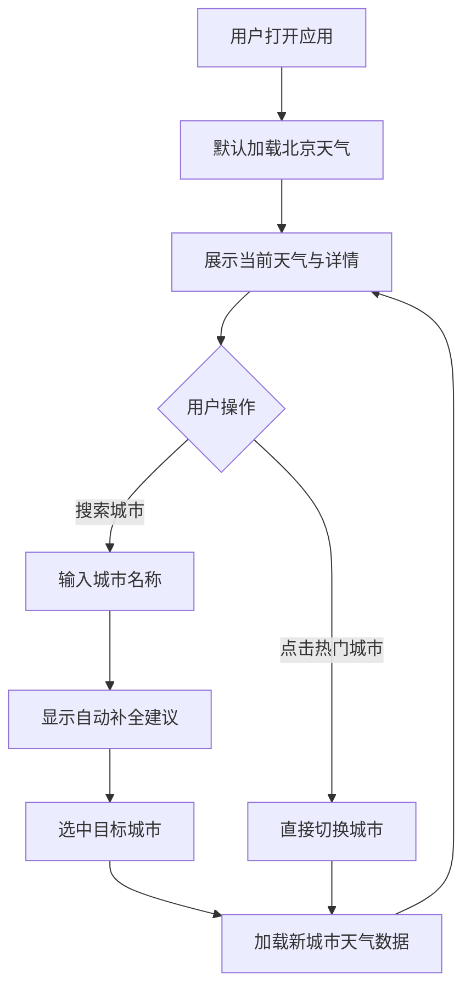

## 1. 产品概述

全球天气查看应用（GlobalWeather）是一款面向所有用户的天气查询 Web 应用，支持搜索全球任意城市，实时查看当前天气状况、未来天气预报以及详细气象数据。

- 主要用途：帮助用户快速了解全球各地的实时天气与未来天气趋势，方便出行规划
- 目标用户：日常出行者、旅行者、气象爱好者
- 产品价值：提供美观直观的可视化天气信息，一站式掌握全球天气动态

## 2. 核心功能

### 2.1 功能模块

1. **首页（天气仪表盘）**：搜索栏、当前天气展示、未来天气预报、天气详情面板、热门城市快捷入口
2. **城市搜索与切换**：全局搜索城市，支持自动补全，快速切换查看不同城市天气

### 2.2 页面详情

| 页面名称 | 模块名称 | 功能描述 |
|----------|----------|----------|
| 首页 | 搜索栏 | 输入城市名称搜索，支持自动补全建议，回车或点击选中城市后加载天气 |
| 首页 | 当前天气卡片 | 展示城市名称、当前温度、天气状况图标、体感温度、最高/最低温度 |
| 首页 | 天气详情面板 | 展示湿度、风速风向、气压、能见度、紫外线指数、日出日落时间 |
| 首页 | 未来天气预报 | 展示未来 5 天的天气预报，每天显示日期、天气图标、最高/最低温度 |
| 首页 | 热门城市快捷入口 | 预置全球知名城市（北京、东京、纽约、伦敦、巴黎、悉尼等），点击快速切换 |
| 首页 | 小时温度趋势 | 展示当天 24 小时的温度变化折线图 |

## 3. 核心流程

用户打开应用后，默认展示北京天气。用户可通过搜索栏输入城市名称，系统提供自动补全建议。选中城市后，页面加载并展示该城市的实时天气信息、天气详情和未来预报。用户也可点击热门城市快捷入口直接切换。

## 4. 用户界面设计

### 4.1 设计风格

- **主色调**：深邃的夜空蓝（#0B1426）作为背景，搭配明亮的天蓝色（#38BDF8）和暖橙色（#FB923C）作为强调色
- **辅助色**：白色文字为主，浅灰蓝色（#94A3B8）为辅
- **按钮风格**：圆角胶囊形按钮，带有微妙的玻璃态效果（glassmorphism）
- **字体**：标题使用 "Outfit" 字体，正文使用 "DM Sans" 字体
- **布局风格**：卡片式布局，半透明毛玻璃卡片，整体呈现深色系科技感
- **图标**：使用天气相关的 SVG 图标（晴天、多云、雨天、雪天等），线条简洁

### 4.2 页面设计概述

| 页面名称 | 模块名称 | UI 元素 |
|----------|----------|---------|
| 首页 | 搜索栏 | 顶部居中，圆角搜索框带搜索图标，下拉建议列表带毛玻璃效果 |
| 首页 | 当前天气卡片 | 大卡片居中，城市名大字显示，温度超大数字，天气图标动态效果 |
| 首页 | 天气详情面板 | 网格排列的小卡片，每个卡片含图标+数值+标签 |
| 首页 | 未来天气预报 | 横向排列 5 天预报卡片，每天含日期、图标、温度范围 |
| 首页 | 热门城市 | 横向滚动的城市标签按钮，选中态高亮 |
| 首页 | 小时温度趋势 | 折线图区域，渐变填充，平滑曲线 |

### 4.3 响应式

- 桌面端优先设计，最小宽度 1024px
- 使用 CSS Grid 自适应布局，卡片网格在不同屏幕宽度下自动调整列数
- 搜索栏和热门城市在小屏幕上自动换行

### 4.4 动效设计

- 页面加载时卡片依次渐入（stagger animation）
- 切换城市时天气卡片有平滑过渡效果
- 天气图标有微妙的悬浮动画
- 温度数字变化时有计数动画效果
- 背景有缓慢流动的渐变光效
