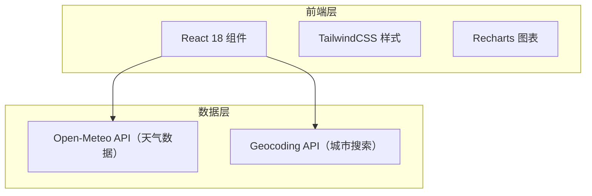

## 1. 架构设计



本项目为纯前端应用，无需后端服务。通过调用免费的 Open-Meteo 天气 API 获取实时天气数据，使用其 Geocoding API 实现城市搜索功能。

## 2. 技术说明

- **前端框架**：React 18 + TypeScript
- **样式方案**：TailwindCSS 3
- **构建工具**：Vite（通过 `create vite` 初始化）
- **图表库**：Recharts（用于小时温度趋势折线图）
- **天气数据**：Open-Meteo API（免费、无需 API Key）
  - 当前天气 + 每日预报：`https://api.open-meteo.com/v1/forecast`
  - 城市地理编码：`https://geocoding-api.open-meteo.com/v1/search`
- **小时数据**：Open-Meteo 的 hourly 参数获取 24 小时温度数据
- **数据状态**：使用 React useState + useEffect 管理数据获取状态

## 3. 路由定义

| 路由 | 用途 |
|------|------|
| `/` | 首页 - 天气仪表盘，包含搜索、当前天气、详情、预报、趋势图 |

单页面应用，所有功能集中在首页。

## 4. API 定义

### 4.1 城市搜索（Geocoding API）

```typescript
// 请求
interface GeocodingRequest {
  name: string;       // 城市名称
  count?: number;     // 返回数量，默认 5
  language?: string;  // 语言，默认 zh
}

// 响应
interface GeocodingResult {
  results: Array<{
    id: number;
    name: string;
    latitude: number;
    longitude: number;
    country: string;
    admin1?: string;  // 省/州
  }>;
}
```

### 4.2 天气数据（Forecast API）

```typescript
// 请求
interface WeatherRequest {
  latitude: number;
  longitude: number;
  current: string;        // 当前天气参数
  daily: string;          // 每日预报参数
  hourly: string;         // 每小时参数
  timezone: string;       // 时区
  forecast_days: number;  // 预报天数
}

// 响应
interface WeatherData {
  current: {
    temperature_2m: number;
    relative_humidity_2m: number;
    apparent_temperature: number;
    weather_code: number;
    wind_speed_10m: number;
    wind_direction_10m: number;
    surface_pressure: number;
    is_day: number;
  };
  daily: {
    time: string[];
    weather_code: number[];
    temperature_2m_max: number[];
    temperature_2m_min: number[];
    sunrise: string[];
    sunset: string[];
    uv_index_max: number[];
    precipitation_probability_max: number[];
  };
  hourly: {
    time: string[];
    temperature_2m: number[];
    weather_code: number[];
  };
}
```

### 4.3 天气代码映射

使用 WMO 标准天气代码（0-99），映射为中文天气描述和对应图标。

## 5. 项目结构

```
src/
├── App.tsx              # 主应用组件
├── main.tsx             # 入口文件
├── index.css            # 全局样式
├── types/
│   └── weather.ts       # TypeScript 类型定义
├── utils/
│   ├── weatherCodes.ts  # 天气代码映射
│   └── api.ts           # API 请求封装
├── components/
│   ├── SearchBar.tsx         # 搜索栏组件
│   ├── CurrentWeather.tsx    # 当前天气卡片
│   ├── WeatherDetails.tsx    # 天气详情面板
│   ├── DailyForecast.tsx     # 每日天气预报
│   ├── HourlyChart.tsx       # 小时温度趋势图
│   ├── CityShortcuts.tsx     # 热门城市快捷入口
│   └── WeatherIcon.tsx       # 天气图标组件
```
